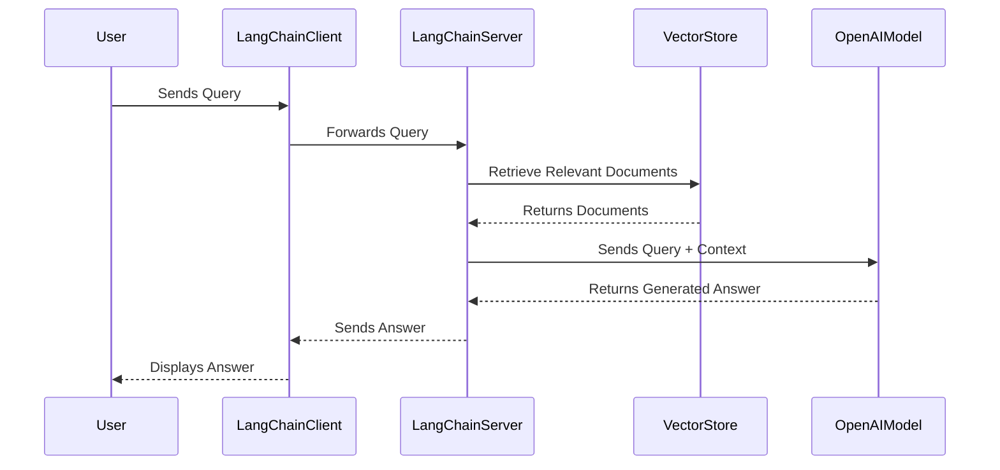

# AREP-LAB08-PT2
AREP Lab 8 Part II

# LangChain RAG Application

## Introduction

This project implements a Retrieval Augmented Generation (RAG) server using LangChain, demonstrating how to combine prompt templates, LLM chains, retrieval mechanisms, and conversation memory to answer user queries based on web content. The goal is to improve the ability of language models, such as GPT, to generate more accurate and complete answers to complex questions by incorporating external and relevant information through information retrieval techniques.

## System Architecture

The application's architecture is built upon FastAPI and LangChain to implement a Retrieval-Augmented Generation (RAG) model. FastAPI serves as the web server, exposing a single /rag endpoint that accepts user queries and returns a system-generated response. The API enables users to inquire about specific information and receive contextual, relevant answers.

At the core of the application is LangChain, a library that facilitates the integration of language models with complex text processing workflows. It utilizes Chroma, a vector database, to store and retrieve documents related to the user's query. These documents are loaded from specific URLs using WebBaseLoader and divided into smaller fragments using RecursiveCharacterTextSplitter for indexing. The text fragments are represented using OpenAIEmbeddings, which converts the documents into vectors that can be efficiently retrieved.

When a user submits a query, the question is processed alongside the retrieved documents using GPT-4 (via ChatOpenAI) to generate a response. LangChain connects all these components into a processing chain, which includes document retrieval, text generation, and post-processing of the response using a StrOutputParser. This is all orchestrated through a RAG chain that allows the model to leverage the retrieved information to generate more accurate responses.

### Architecture Diagram



## Installation and Execution

To install and run this application locally, follow these steps: 

1. Clone the repository:

```bash
git clone https://github.com/CamiloMurcia28/AREP-LAB08-PT2.git
cd AREP-LAB08-PT2
```

Next, you must edit the RAGProyect.py file on lines 11 and 12 to enter the ChatGPT API key and the LangChain API key (the specific keys are indicated in the Moodle delivery comments).

Here's a shorter version of the steps with clearer instructions in English:

Obtain API Keys:

### OpenAI:

Log in to https://openai.com/ and access your profile (top-right corner).
Select "View API Keys" and create a new secret key.
Important: Save this key securely, as it won't be retrievable later.

### LangSmith:

Log in to https://www.langchain.com/langsmith and go to your account settings.
Generate a new API key.

```bash
os.environ["OPENAI_API_KEY"] = "(OPEN_AI KEY)"
os.environ["LANGCHAIN_API_KEY"] = "(LANG_API KEY)"
```

2. Build and run:

```bash
python -m venv .venv
cd .venv/Scripts
activate
pip install -r requirements.txt
python RAGServer.py
```

## Code in Action


Video of the Application Running

[VIDEO 8](https://youtu.be/SFR3dDg2lzk)

### Build with:
    
* [Git](https://git-scm.com) - Version Control System
- [Lang Chain](https://python.langchain.com/docs/get_started/introduction) - Python Library to interact with AI
- [OpenAI](https://openai.com/) - AI Plataform
* [Python](https://www.python.org/) - Programming Language

## Versioning


## Author

- Camilo Murcia Espinosa

## License

[](https://creativecommons.org/licenses/by-sa/4.0/deed.es)

This project is licensed under the MIT License - see the [LICENSE](LICENSE) for details

## Acknowledgements

- To Professor [Luis Daniel Benavides Navarro](https://ldbn.is.escuelaing.edu.co) for sharing his knowledge.
